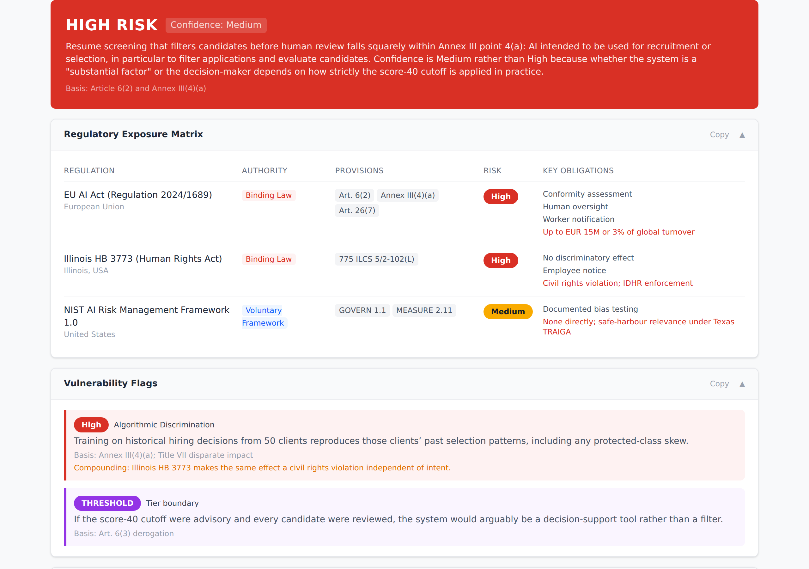
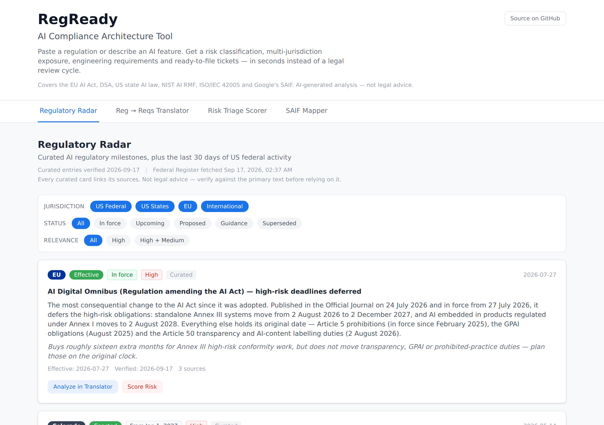

<div align="center">

# RegReady

**Turn AI regulation into risk classifications, engineering requirements and framework gap analysis — in seconds instead of a legal review cycle.**

[**Try it live →**](https://reg-ready.vercel.app/)

[](https://github.com/delschlangen/regready/actions/workflows/ci.yml)
[](LICENSE)
[](https://www.anthropic.com/api)

</div>

---

Compliance teams and product teams speak different languages. A regulation says
"deployers of high-risk AI systems shall implement human oversight measures";
an engineer needs to know which service to change, by when, and what "done"
looks like. RegReady closes that gap in both directions — and tracks what
changed while you weren't looking.

<p align="center">
  
</p>

## What it does

### Regulatory Radar
A curated timeline of AI regulatory milestones plus the last 30 days of US
federal activity from the Federal Register.

Every curated entry is hand-verified, dated, and cites its sources — and
crucially, it says when a law **is no longer in force**. Colorado SB 24-205 is
listed as repealed (SB 26-189 replaced it, effective 2027-01-01); California
AB 2655 is listed as enjoined. Status badges are computed from the dates, so a
card reads "In force" or "In 12 days" rather than a hand-typed label that
goes stale the moment a deadline passes.

### Reg → Reqs Translator
Paste a provision. Get the product impact in plain English, prioritised
engineering requirements traced back to the article, and ready-to-file tickets
with acceptance criteria, labels and story points.

### Risk Triage Scorer
Describe an AI feature. Get an EU AI Act risk tier with calibrated confidence,
a multi-jurisdiction exposure matrix that **separates binding law from voluntary
frameworks**, compounding-risk analysis where regulations overlap, and a
concrete path to a compliant version.

Features sitting on a tier boundary get a dedicated `THRESHOLD` flag describing
what would push the classification either way — because "it depends" is often
the honest answer, and burying it helps nobody.

### SAIF Mapper
Map a provision against the six elements of Google's Secure AI Framework: which
are fully addressed, which partially, and where the gaps are.

SAIF is a *security* framework, so it will not cover every regulatory
obligation — the tool says so rather than inflating the score. Transparency,
consumer rights and non-technical governance duties routinely show as gaps, and
the cross-framework section explains where NIST AI RMF, ISO/IEC 42001 and
ISO/IEC 42005 pick up the slack.

<p align="center">
  
</p>

## Taking results with you

Every analysis exports as **Markdown**, **JSON**, or a printed PDF, so a risk
assessment can go straight into a ticket, a doc or a review packet. Exports
carry the source link and the not-legal-advice line, so a pasted result stays
attributed.

Tabs are addressable — `?tab=saif` deep-links — and results persist while you
move between tabs, so the cross-tab handoffs ("Score this regulation's risk",
"Turn these SAIF gaps into requirements") don't cost you the analysis you were
reading.

## Coverage

| Framework | Jurisdiction | Notes |
|---|---|---|
| **EU AI Act** (2024/1689) | EU | Art. 5 prohibitions, Annex III high-risk, Art. 50 transparency, Art. 27 FRIA. High-risk deadlines reflect the Digital Omnibus deferral (Annex III → 2027-12-02, Annex I → 2028-08-02) |
| **Digital Services Act** (2022/2065) | EU | VLOP/VLOSE systemic risk and mitigation |
| **Colorado SB 26-189** | US state | Replaced the repealed SB 24-205; effective 2027-01-01 |
| **Texas TRAIGA** (H.B. 149) | US state | In force since 2026-01-01 |
| **California SB 53 / TFAIA** | US state | Frontier-model transparency, in force 2026-01-01 |
| **California SB 942** (as amended by AB 853) | US state | Operative 2026-08-02 |
| **New York RAISE Act** (as amended) | US state | 72-hour incident reporting, effective 2027-01-01 |
| **Illinois HB 3773** | US state | AI in employment, in force 2026-01-01 |
| **NIST AI RMF 1.0** | US | Voluntary; safe-harbour relevance under TRAIGA |
| **ISO/IEC 42005:2025** | International | AI impact assessment methodology |
| **Google SAIF** | — | Six-element security framework |
| **Sector-specific** | Multi | HIPAA, FCRA/ECOA, Fair Housing Act, Title VII |

Curated regulatory data is verified as of the date shown in the app and on each
card. **This is not legal advice** — verify against the primary text before
relying on it.

## API keys and cost

The **Regulatory Radar is free to browse** — curated milestones with sources,
plus the last 30 days of US federal activity. No key, no account.

The Translator, Risk Scorer and SAIF Mapper each run a Claude model, so they
need an Anthropic API key:

- **Visitors** paste their own key in Settings. It is kept in that browser's
  localStorage, sent over HTTPS to this site's API route for the duration of the
  request, and is neither logged nor retained. It pays for that visitor's own
  usage — a few cents per analysis.
- **The deployment owner** sets `OWNER_PASSPHRASE` and enters it once, which
  unlocks the deployment's own `ANTHROPIC_API_KEY`.

There is no third way in. With `OWNER_PASSPHRASE` unset the server key is
unreachable by anyone and the deployment is pure bring-your-own-key — which is
the safest way to run a public instance. A passphrase under 24 characters is
treated as unset, because a per-instance rate limiter cannot protect a billing
account from distributed guessing; entropy has to do that work.

If you deploy this, also set a spend limit on the key in the Anthropic Console.
That is the only hard ceiling, and no amount of application code substitutes
for it.

## Running it yourself

```bash
git clone https://github.com/delschlangen/regready.git
cd regready
npm install

cp .env.example .env.local   # add your ANTHROPIC_API_KEY

npx vercel dev               # serves the app and the /api functions
```

`npm run dev` runs the frontend alone; the analysis tabs need the serverless
functions, so use `vercel dev` for the full app.

```bash
npm test          # prompt-drift, curated-data and export guards (no API calls)
npm run build     # production build
npm run og        # regenerate the social preview image
npm run shots     # regenerate the README screenshots
```

Deploying your own instance: [docs/DEPLOY.md](docs/DEPLOY.md).

`ANTHROPIC_MODEL` overrides the model (default `claude-sonnet-5`).

## How it fits together

```
                        React (Vite + Tailwind)
   ┌──────────┬──────────────┬───────────────┬──────────────┐
   │  Radar   │  Translator  │  Risk Scorer  │ SAIF Mapper  │
   └────┬─────┴───────┬──────┴───────┬───────┴──────┬───────┘
        │             └──────────────┼──────────────┘
        │                    POST /api/analyze
        │              mode: translator | riskScorer | saif
        │                            │
        ├── GET  /api/radar-federal  │   ← Federal Register API (free)
        └── POST /api/radar-summarize│
                     │               │
                     ▼               ▼
          ┌──────────────────────────────────────┐
          │      Vercel serverless functions     │
          │  api/_lib/claude.js — shared client, │
          │  cached system prompts, JSON parsing │
          └──────────────────┬───────────────────┘
                             ▼
                   Anthropic Claude API
```

The system prompts live in `src/prompts/` and are **imported** by the API — they
used to be duplicated inline, drifted, and several rules never reached
production. `npm test` now asserts reference equality so that cannot recur.

## Why it exists

AI regulation is moving faster than compliance teams can read it, and the
translation layer between "what the law says" and "what to build" is where
programs stall. RegReady is a working demonstration that the translation can be
largely automated — and that the hard part is not summarising the law, it's
being honest about what is in force, what is contested, and what a framework
genuinely does not cover.

Built by Del Schlangen. MIT licensed.
